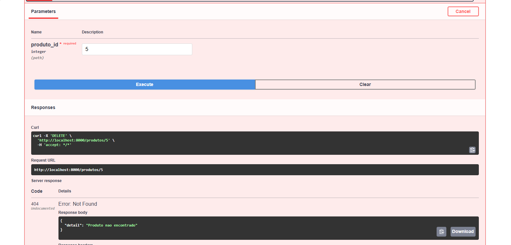

# Crud2 — API REST + App Android

Trabalho acadêmico de CRUD completo de uma entidade (`Produto`), com **API REST em Python (FastAPI)** consumida por um **app Android nativo (Kotlin + Retrofit)**.

## Arquitetura

```
┌─────────────────────┐        HTTP/JSON         ┌────────────────────────┐
│                     │ ◄──────────────────────► │                        │
│   App Android       │   GET    /produtos       │   API FastAPI          │
│   (Kotlin)          │   POST   /produtos       │   (Python)             │
│                     │   PUT    /produtos/{id}  │                        │
│   Retrofit + Gson   │   DELETE /produtos/{id}  │   uvicorn + Pydantic   │
└─────────────────────┘                          └────────────────────────┘
```

O cliente Android faz chamadas HTTP usando **Retrofit** (que serializa/deserializa JSON via Gson) contra a API FastAPI rodando localmente. Os dados são armazenados em memória.

## Tecnologias

| Camada | Tecnologia |
|---|---|
| **Backend** | Python 3.10+, FastAPI, Uvicorn, Pydantic |
| **Documentação da API** | Swagger UI (gerado automaticamente pelo FastAPI) |
| **Frontend mobile** | Kotlin, Android SDK 36, Retrofit 2, Coroutines |
| **Componentes Android** | RecyclerView, ViewBinding via `findViewById` |

## Estrutura do repositório

```
crud2/
├── python/
│   ├── main.py                  # Aplicação FastAPI com os endpoints CRUD
│   └── requirements.txt         # Dependências Python
│
├── android/                     # Projeto Android Studio
│   └── app/
│       ├── src/main/
│       │   ├── AndroidManifest.xml
│       │   ├── java/com/example/crud2/
│       │   │   ├── MainActivity.kt     # Tela única do app
│       │   │   └── Produto.kt          # Modelo + Retrofit + Adapter
│       │   └── res/layout/
│       │       ├── activity_main.xml   # Layout da tela
│       │       └── item_produto.xml    # Layout de cada item da lista
│       └── build.gradle.kts
│
└── README.md
```

---

## Pré-requisitos

- **Python 3.10 ou superior** (usa sintaxe `int | None`)
- **Android Studio** (versão Hedgehog 2023.1+ recomendada)
- **Emulador Android API 24+** ou celular físico em modo desenvolvedor

---

## Como executar

A ordem importa: **primeiro a API, depois o app**.

### 1. Subir a API Python

Abra um terminal na pasta `api/`:

```bash
# Instalar dependências (primeira vez apenas)
pip install -r requirements.txt

# Subir a API
python -m uvicorn main:app --host 0.0.0.0 --port 8000 --reload
```

> No Windows, se o comando `python` não funcionar, use `py` no lugar.

A API estará rodando em `http://localhost:8000`. Deixe esse terminal **aberto** enquanto for usar o app.

**Validação:** abra `http://localhost:8000/docs` no navegador. Deve aparecer o Swagger UI com todos os endpoints.

### 2. Rodar o app Android

1. Abra a pasta `android/` no Android Studio.
2. Aguarde o Gradle sincronizar (primeira vez demora alguns minutos).
3. Inicie o emulador (ou conecte um celular físico).
4. Aperte **Run** (▶️).

**Importante** — o app precisa saber o endereço da API. Em `Produto.kt`, dentro do objeto `ApiClient`, a constante `BASE_URL` controla esse endereço:

| Cenário | Valor de `BASE_URL` |
|---|---|
| Emulador Android (padrão) | `http://10.0.2.2:8000/` |
| Celular físico na mesma Wi-Fi | `http://SEU_IP_LOCAL:8000/` (ex.: `http://192.168.0.10:8000/`) |

> `10.0.2.2` é o endereço especial que o emulador Android usa pra acessar o `localhost` da máquina host. Não use `127.0.0.1` no emulador.

---

## API — Endpoints

Documentação interativa: `http://localhost:8000/docs`

| Método | Rota | Descrição | Códigos de resposta |
|---|---|---|---|
| `GET`    | `/produtos`        | Listar todos os produtos     | `200` |
| `GET`    | `/produtos/{id}`   | Buscar produto por ID        | `200`, `404` |
| `POST`   | `/produtos`        | Criar novo produto           | `201`, `409`, `422` |
| `PUT`    | `/produtos/{id}`   | Atualizar produto existente  | `200`, `400`, `404`, `422` |
| `DELETE` | `/produtos/{id}`   | Deletar produto              | `204`, `404` |

### Modelo `Produto`

```json
{
  "id": 1,
  "nome": "Mouse",
  "preco": 89.90
}
```

| Campo | Tipo | Obrigatório | Regras |
|---|---|---|---|
| `id` | `int` | Opcional no POST | Se omitido, é gerado pela API |
| `nome` | `string` | Sim | Não pode ser vazio |
| `preco` | `float` | Sim | Deve ser maior que zero |

### Comportamento e validações

**POST `/produtos`**
- Se o `id` for omitido, a API gera o próximo disponível.
- Se o `id` for informado e **não estiver em uso**, a API o respeita.
- Se o `id` for informado e **já existir**, retorna `409 Conflict`.
- Se `nome` for vazio ou `preco` <= 0, retorna `422 Unprocessable Entity`.

**PUT `/produtos/{id}`**
- Se o `id` enviado no corpo da requisição **não bater** com o `id` da URL, retorna `400 Bad Request`.
- Se o produto não existir, retorna `404`.
- Mesmas validações de `nome` e `preco` do POST.

**GET e DELETE em ID inexistente**
- Retornam `404 Not Found`.

### Exemplo de uso (cURL)

```bash
# Criar produto
curl -X POST http://localhost:8000/produtos \
     -H "Content-Type: application/json" \
     -d '{"nome": "Teclado", "preco": 250.00}'

# Listar
curl http://localhost:8000/produtos

# Atualizar
curl -X PUT http://localhost:8000/produtos/1 \
     -H "Content-Type: application/json" \
     -d '{"nome": "Teclado Mecanico", "preco": 450.00}'

# Deletar
curl -X DELETE http://localhost:8000/produtos/1
```

---

## App Android — Funcionalidades

O app é composto por **uma única tela** com três áreas:

1. **Formulário superior** — dois campos (`Nome do produto` e `Preço`) e um botão **Adicionar**.
2. **Lista de produtos** — exibida abaixo do formulário, com nome, preço formatado em reais e um botão `X` para deletar.
3. **Mensagens** — `Toast` exibe erros de rede ou falhas da API.

### Fluxo de uso

| Ação no app | Chamada HTTP | Atualização da UI |
|---|---|---|
| Abrir o app | `GET /produtos` | Lista é preenchida |
| Botão **Adicionar** | `POST /produtos` | Lista é recarregada após sucesso |
| Botão **X** num item | `DELETE /produtos/{id}` | Lista é recarregada após sucesso |

### Componentes principais (`Produto.kt`)

O arquivo `Produto.kt` concentra:

```kotlin
data class Produto(...)              // modelo serializado pelo Gson
interface ApiService { ... }         // contrato dos endpoints (Retrofit)
object ApiClient { ... }             // singleton com o cliente Retrofit
class ProdutoAdapter(...) { ... }    // adapter do RecyclerView
```

Centralizar tudo num único arquivo é uma escolha deliberada para um projeto introdutório — simplifica a navegação sem prejuízo de organização para uma única entidade.

### Permissões necessárias

No `AndroidManifest.xml`:

```xml
<uses-permission android:name="android.permission.INTERNET" />

<application
    ...
    android:usesCleartextTraffic="true">
```

A flag `usesCleartextTraffic` é necessária porque a API local não usa HTTPS. Em produção, o tráfego deveria ser sobre TLS e essa flag não seria necessária.

---

## Considerações técnicas

### Persistência

A API guarda os produtos em uma **lista em memória** (variável global `produtos`). Quando o servidor é reiniciado, **todos os dados são perdidos**. Para persistência real, seria necessário integrar um banco de dados (ex.: SQLite com SQLAlchemy).

### CORS

O middleware CORS está configurado para aceitar **qualquer origem** (`allow_origins=["*"]`), o que é apropriado para desenvolvimento mas inseguro em produção.

### Concorrência

A geração de IDs usa uma variável `proximo_id` global sem lock. Em ambiente multi-thread/multi-worker poderia haver corridas de condição. Como o app só usa um worker do uvicorn, não é problema neste cenário.

### Por que Retrofit + Coroutines (e não AsyncTask, Volley etc.)

- **Retrofit** transforma a interface anotada em uma implementação HTTP automaticamente, evitando código repetitivo de `HttpURLConnection`.
- **Coroutines** com `suspend fun` permitem escrever chamadas assíncronas com sintaxe sequencial, sem callbacks aninhados.
- A combinação é o padrão recomendado pelo Google para apps Android modernos.

---

## Solução de problemas

| Sintoma | Causa provável | Solução |
|---|---|---|
| Toast "Erro: Failed to connect to /10.0.2.2:8000" | API não está rodando | Subir o uvicorn na máquina host |
| Toast "Erro: timeout" | API rodou sem `--host 0.0.0.0` | Reiniciar a API com o flag correto |
| App crasha ao abrir | `item_produto.xml` ausente ou com layout diferente | Conferir o arquivo na pasta `res/layout/` |
| "CLEARTEXT communication not permitted" | Faltou `usesCleartextTraffic="true"` no Manifest | Adicionar atributo no `<application>` |
| Build falha pedindo `compileSdk` maior | Dependências exigem SDK mais novo | Atualizar `compileSdk = 36` no `build.gradle.kts (Module :app)` |

---

## Imagens




